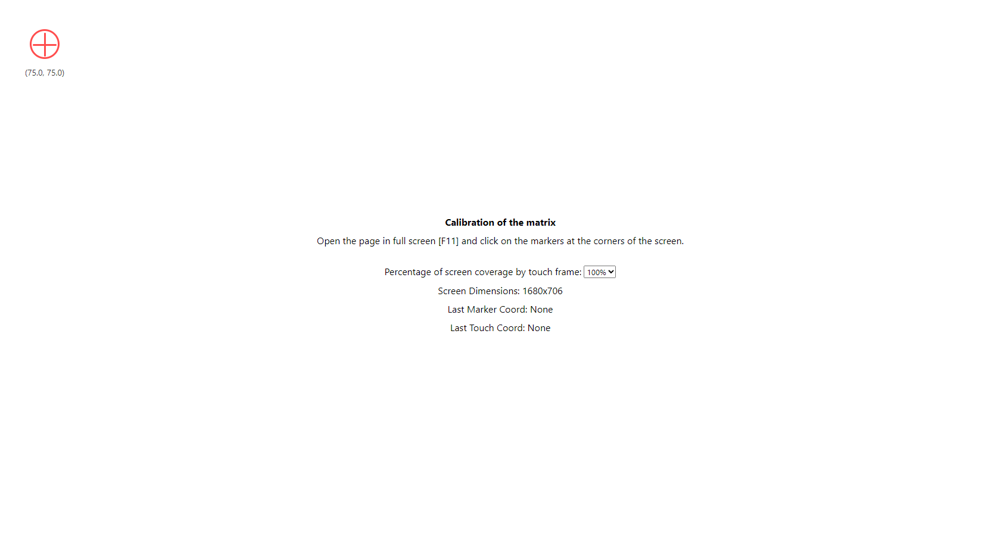

# IR Touch Frame Calibration Tool

        

This is a simple touch frame calibration tool, designed to help you calibrate the touchscreen of your device using `libinput Calibration Matrix`. The tool displays a marker in each corner of the screen, and you need to touch the marker at each position to collect the necessary data for calibration.

## Screenshots of the tool

Here are some screenshots of the calibration tool in action:

## How to use

1. Visit the calibration tool website at https://quzile.github.io/TouchFrame-Calibration/.
2. Press `F11` to open the browser in fullscreen mode.
3. Touch the markers as they appear in each corner of the screen, one at a time.
4. After touching all four corners, the script will calculate the calibration matrix and display the `xinput set-prop` command with the calculated values.
5. Copy and execute the generated command in your terminal to apply the new calibration matrix to your touch frame.

## Code explanation

The script creates a marker element and attaches it to the body of the document.
The marker is positioned in each corner of the screen, one at a time, and the user is asked to touch the marker.
The script saves the coordinates of the touch event and the marker position.
After all four corners have been touched, the script calculates the deviations for the `X` and `Y` axes based on the collected data.
Using the deviations, the script calculates the values for the `libinput Calibration Matrix` and displays the `xinput set-prop` command with the calculated values.
The user can copy the generated command and execute it in the terminal to apply the new calibration matrix to their touch frame.

## Notes

Make sure to replace `{YOUR FRAME ID}` in the generated command with the appropriate ID of your touch frame device. You can find the ID using the xinput list command in the terminal.
This script assumes that the touch frame is already rotated correctly. If you need to rotate the touch frame, use the Coordinate Transformation Matrix property.

The calibration calculations in this project are based on the methods described in the [Arch Linux Wiki](https://wiki.archlinux.org/title/Talk:Calibrating_Touchscreen).

## License

This project is licensed under the MIT License.

## Contributing

We welcome contributions to improve this touch frame calibration tool. If you have suggestions or bug fixes, please create an issue or submit a pull request on the project's GitHub repository.

## Contacts

If you have any questions or need assistance, feel free to reach out to the project maintainers via the contact information provided on the project's GitHub repository.
